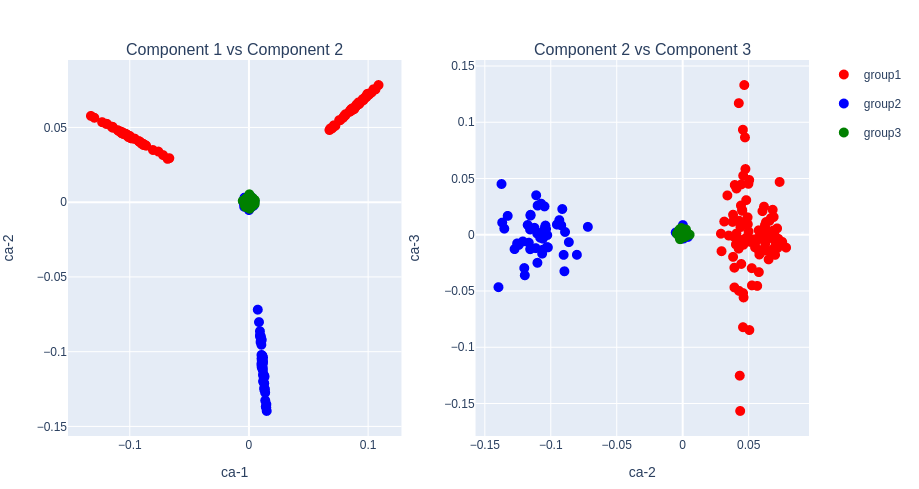
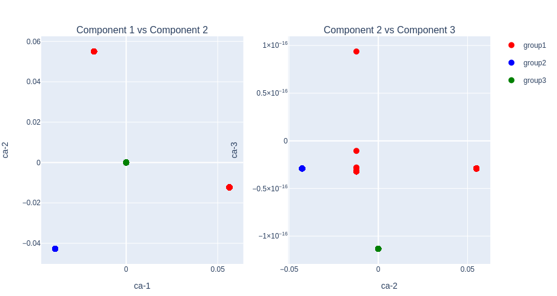

# OnlineCA.jl
Online Correspondence Analysis

[](https://github.com/chiba-ai-med/OnlineCA.jl/actions/workflows/CI.yml?query=branch%3Amain)

## 📚 Documentation
[](https://chiba-ai-med.github.io/OnlineCA.jl/dev)

## Description
OnlineCA.jl performs out-of-core Correspondence Analysis (CA) for extremely large scale matrix without loading the whole data on the memory space. Multiple Correspondence Analysis (MCA) on categorical tables is also supported via the same out-of-core machinery.

CA is a statistical method to analyze a contingency table by decomposing the standardized residual matrix

```
S = D_r^{-1/2} (P - r_p c_p') D_c^{-1/2}
```

where `P = X / n` is the relative-frequency matrix, `r_p = P 1` is the row-mass vector, `c_p = P' 1` is the column-mass vector, and `D_r = diag(r_p)`, `D_c = diag(c_p)` are the corresponding diagonal mass matrices. The matrix `S` is never explicitly formed. Instead, matrix–vector products `S * v` and `S' * u` are computed by streaming through the data, and the top singular triplets are extracted with a Halko-style randomized SVD.

__Note: The input matrix is supposed to be a non-negative count matrix (contingency table) for CA, or an integer-coded categorical table for MCA.__

## Algorithms
- Halko-style Randomized SVD on the implicit standardized residual matrix : [Halko, N. et al., 2011](https://arxiv.org/abs/0909.4061), [Halko, N. et al., 2011](https://epubs.siam.org/doi/abs/10.1137/100804139)
- Multiple Correspondence Analysis (MCA) via indicator matrix → CA, with Benzécri / Greenacre eigenvalue corrections

## Installation
```julia
# push the key "]" and type the following command.
(@julia) pkg> add https://github.com/rikenbit/OnlinePCA.jl
(@julia) pkg> add https://github.com/chiba-ai-med/OnlineCA.jl
(@julia) pkg> add PlotlyJS
# After that, push Ctrl + C to leave from Pkg REPL mode
```

## Basic API usage
### Preprocess of CSV
```julia
using OnlinePCA
using OnlinePCA: write_csv
using OnlineCA
using Distributions
using DelimitedFiles
using SparseArrays
using MatrixMarket

# CSV (Input data is supposed to be non-negative integer count)
tmp = mktempdir()
data = Int64.(ceil.(rand(NegativeBinomial(1, 0.5), 300, 99)))
data[1:50, 1:33] .= 100*data[1:50, 1:33]
data[51:100, 34:66] .= 100*data[51:100, 34:66]
data[101:150, 67:99] .= 100*data[101:150, 67:99]
write_csv(joinpath(tmp, "Data.csv"), data)

# Matrix Market (MM)
mmwrite(joinpath(tmp, "Data.mtx"), sparse(data))

# Binary COO (BinCOO)
data2 = zeros(Int, 300, 99)
data2[1:50, 1:33] .= 1
data2[51:100, 34:66] .= 1
data2[101:150, 67:99] .= 1
data2[151:300, :] .= 1

bincoofile = joinpath(tmp, "Data.bincoo")
open(bincoofile, "w") do io
    for i in 1:size(data2, 1)
        for j in 1:size(data2, 2)
            if data2[i, j] != 0
                println(io, "$i $j")
            end
        end
    end
end

# Binarization (Zstandard)
csv2bin(csvfile=joinpath(tmp, "Data.csv"), binfile=joinpath(tmp, "Data.zst"))

# Sparsification (Zstandard + MM format)
mm2bin(mmfile=joinpath(tmp, "Data.mtx"), binfile=joinpath(tmp, "Data.mtx.zst"))

# Binarization (BinCOO + Zstandard)
bincoo2bin(bincoofile=bincoofile, binfile=joinpath(tmp, "Data.bincoo.zst"))
```

### Setting for plot
```julia
using DataFrames
using PlotlyJS

function subplots(out_ca, group)
    # data frame
    data_left = DataFrame(ca1=out_ca[1][:,1], ca2=out_ca[1][:,2], group=group)
    data_right = DataFrame(ca2=out_ca[1][:,2], ca3=out_ca[1][:,3], group=group)
    # plot
    p_left = Plot(data_left, x=:ca1, y=:ca2, mode="markers", marker_size=10, group=:group)
    p_right = Plot(data_right, x=:ca2, y=:ca3, mode="markers", marker_size=10,
    group=:group, showlegend=false)
    p_left.data[1]["marker_color"] = "red"
    p_left.data[2]["marker_color"] = "blue"
    p_left.data[3]["marker_color"] = "green"
    p_right.data[1]["marker_color"] = "red"
    p_right.data[2]["marker_color"] = "blue"
    p_right.data[3]["marker_color"] = "green"
    p_left.data[1]["name"] = "group1"
    p_left.data[2]["name"] = "group2"
    p_left.data[3]["name"] = "group3"
    p_left.layout["title"] = "Component 1 vs Component 2"
    p_right.layout["title"] = "Component 2 vs Component 3"
    p_left.layout["xaxis_title"] = "ca-1"
    p_left.layout["yaxis_title"] = "ca-2"
    p_right.layout["xaxis_title"] = "ca-2"
    p_right.layout["yaxis_title"] = "ca-3"
    plot([p_left p_right])
end

group=vcat(repeat(["group1"],inner=100), repeat(["group2"],inner=100), repeat(["group3"],inner=100))
```

### Correspondence Analysis (CA)
```julia
out_ca = ca(input=joinpath(tmp, "Data.zst"), dim=3, noversamples=5, niter=3, chunksize=100)

subplots(out_ca, group)
```


### Sparse Correspondence Analysis (Sparse-CA)
```julia
out_sparse_ca = sparse_ca(input=joinpath(tmp, "Data.mtx.zst"), dim=3, noversamples=5, niter=3, chunksize=100)

subplots(out_sparse_ca, group)
```


### BinCOO Correspondence Analysis (BinCOO-CA)
```julia
out_bincoo_ca = bincoo_ca(input=joinpath(tmp, "Data.bincoo.zst"), dim=3, noversamples=5, niter=3, chunksize=100)

subplots(out_bincoo_ca, group)
```


## Output files
Each CA function returns a NamedTuple. The first five fields preserve the original positional contract — `(rowcoord, colcoord, sigma, inertia, total_inertia) = ca(...)` and integer indexing `out[1]`...`out[5]` keep working — and richer fields are appended for interpretation and visualization:

| Field | Meaning |
|---|---|
| `rowcoord`, `colcoord` | Principal coordinates (`D^{-1/2} U Σ`, `D^{-1/2} V Σ`) |
| `rowstd`,   `colstd`   | Standard coordinates (`D^{-1/2} U`, `D^{-1/2} V`) |
| `rowmass`,  `colmass`  | Marginal probabilities (`r_p`, `c_p`) |
| `rowcontrib`, `colcontrib` | Per-axis contributions (`U.^2`, `V.^2`; columns sum to 1) |
| `rowcos2`,  `colcos2`  | Squared cosines of profile-to-axis angles |
| `sigma`, `inertia`, `total_inertia` | SVD spectrum and total chi-squared / n |
| `valid_rows`, `valid_cols` | Indices of non-zero-mass rows / columns |

When `outdir` is set, each field is written as a CSV under the corresponding name (e.g. `Row_coordinates.csv`, `Row_standard_coordinates.csv`, `Row_mass.csv`, `Row_contributions.csv`, `Row_cos2.csv`, ...).

## Reproducibility, precision, supplementary projection

```julia
# Reproducible runs
out  = ca(input=joinpath(tmp, "Data.zst"), dim=3, seed=42)

# Float32 storage (≈ 2× memory savings for U/V/coords)
out32 = ca(input=joinpath(tmp, "Data.zst"), dim=3, T=Float32)

# Project new (passive) rows / columns into the trained CA space
F_new = project_rows(out,    new_rows)     # n_new × dim
G_new = project_columns(out, new_cols)     # n_new × dim
```

## Multiple Correspondence Analysis (MCA)

`mca(table)` runs MCA on an `N × q` integer-coded categorical table by building the indicator matrix, calling `bincoo_ca`, and attaching MCA metadata. Optional `correction = :benzecri / :greenacre` applies the standard eigenvalue adjustment. **`mca` is available as a Julia API only** — there is no command-line binary because indicator-matrix preparation is naturally an in-memory step.

```julia
# Synthetic categorical data: 200 obs × 4 vars, each with 3 levels
table = rand(1:3, 200, 4)

out_mca = mca(table; dim=3, correction=:benzecri,
              var_names=["age", "sex", "region", "occupation"])

# Adjusted inertia (Benzecri / Greenacre); raw values still in `inertia`
out_mca.inertia_adjusted        # length dim
out_mca.total_inertia_adjusted  # scalar
```

The result NamedTuple extends the CA fields above with the following MCA-specific entries:

| Field | Type | Meaning |
|---|---|---|
| `variables` | `Vector{String}` (length `q`) | Variable names |
| `categories` | `Vector{String}` (length `M`) | Category labels |
| `var_of_category` | `Vector{Int}` (length `M`) | Index of the variable that owns each category |
| `q` | `Int` | Number of variables |
| `correction` | `Symbol` | `:none / :benzecri / :greenacre` |
| `inertia_adjusted` | `Vector` (length `dim`) | Per-axis adjusted eigenvalues |
| `total_inertia_adjusted` | `Real` | Adjusted total inertia |

When `outdir` is given, `mca` additionally writes `Categories.csv`, `Variables.csv`, `Var_of_category.csv`, `Inertia_adjusted.csv`, and `Total_inertia_adjusted.csv` next to the standard CA outputs.

## Command line usage
The type of input file is assumed to be CSV, MM, or BinCOO format, and is preprocessed to a Zstandard-compressed binary file by `csv2bin`, `mm2bin`, or `bincoo2bin` in the `OnlinePCA` package. The binary file is specified as the input of the CA functions in `OnlineCA`. All CA functions can be performed as command line tools with the same parameter names like below.

```bash
# CSV → Julia Binary
julia YOUR_HOME_DIR/.julia/v0.x/OnlinePCA/bin/csv2bin \
    --csvfile Data.csv --binfile Data.zst

# MM → Julia Binary
julia YOUR_HOME_DIR/.julia/v0.x/OnlinePCA/bin/mm2bin \
    --mmfile Data.mtx --binfile Data.mtx.zst

# BinCOO → Julia Binary
julia YOUR_HOME_DIR/.julia/v0.x/OnlinePCA/bin/bincoo2bin \
    --bincoofile Data.bincoo --binfile Data.bincoo.zst

# CA (Dense)
julia YOUR_HOME_DIR/.julia/v0.x/OnlineCA/bin/ca \
    --input Data.zst --dim 3 \
    --noversamples 5 --niter 3 --chunksize 100

# Sparse-CA
julia YOUR_HOME_DIR/.julia/v0.x/OnlineCA/bin/sparse_ca \
    --input Data.mtx.zst --dim 3 \
    --noversamples 5 --niter 3 --chunksize 100

# BinCOO-CA
julia YOUR_HOME_DIR/.julia/v0.x/OnlineCA/bin/bincoo_ca \
    --input Data.bincoo.zst --dim 3 \
    --noversamples 5 --niter 3 --chunksize 100
```

## Contributing

If you have suggestions for how `OnlineCA.jl` could be improved, or want to report a bug, open an issue! We'd love all and any contributions.

## Author
- Koki Tsuyuzaki
