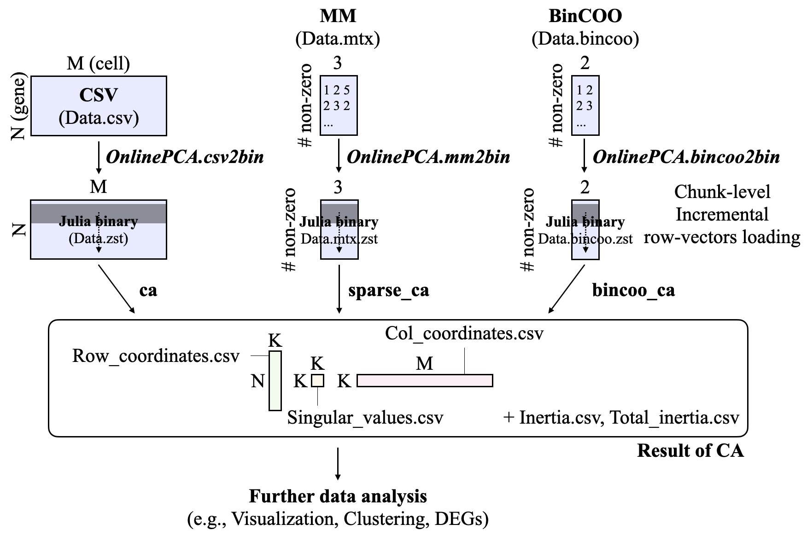
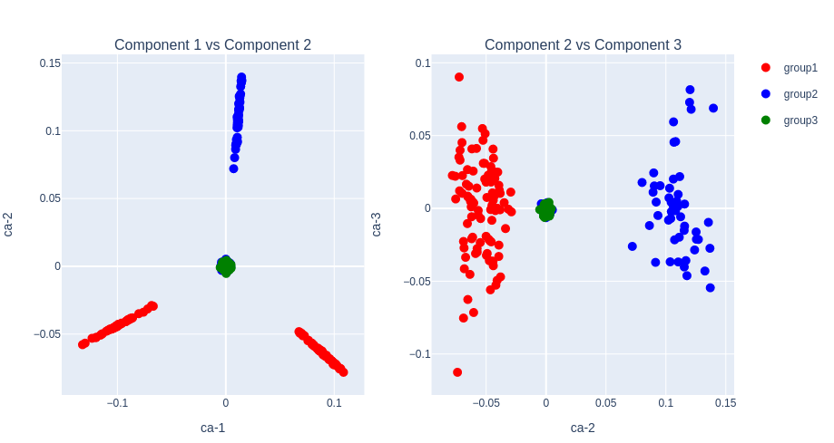

# Summary

Correspondence Analysis (CA) is a multivariate technique for the exploratory analysis of contingency tables [@hill1974; @greenacre2017]. Like Principal Component Analysis (PCA), CA decomposes a data matrix into low-dimensional row and column scores, but it operates on a standardized residual matrix that compares observed counts with the expectation under independence. CA has been widely applied across diverse fields including ecology [@terbraak], linguistics and text analysis [@greenacre2017], market research [@greenacre2017], and more recently single-cell omics [@corral].

Despite its broad applicability, CA becomes computationally prohibitive for large data matrices, since it requires the singular value decomposition (SVD) of an N $\times$ M matrix. In particular, recent advances in single-cell omics have led to datasets with millions of cells, for which standard CA implementations often fail to scale. To meet this requirement, I present \texttt{OnlineCA.jl}, a Julia package for out-of-core and sparse CA (\url{https://github.com/chiba-ai-med/OnlineCA.jl}).

# Statement of need

CA is a workhorse algorithm for exploring contingency tables. However, as the size of the data matrix increases, it often becomes too large to fit into memory. In such cases, an out-of-core (OOC) implementation — where only subsets of data stored on disk are loaded into memory for computation — is desirable. Additionally, representing the data in a sparse matrix format, where only non-zero values and their coordinates are stored, is computationally advantageous. Therefore, a CA implementation that supports both OOC computation and sparse data handling is highly desirable (Figure 1).

Similar discussions have been made in the context of PCA and Non-negative Matrix Factorization (NMF), and we have independently developed Julia packages \texttt{OnlinePCA.jl} [@onlinepcajljoss; @onlinepcajl] and \texttt{OnlineNMF.jl} [@onlinenmfjl]. \texttt{OnlineCA.jl} is a spin-off version of these, implementing CA.

The standardized residual matrix for CA is

$$
S = D_r^{-1/2} \left( P - r_p c_p^\top \right) D_c^{-1/2},
$$

where $P = X / n$ is the relative-frequency matrix, $r_p = P \mathbf{1}$ and $c_p = P^\top \mathbf{1}$ are the row- and column-mass vectors, and $D_r = \mathrm{diag}(r_p)$, $D_c = \mathrm{diag}(c_p)$ are the corresponding diagonal mass matrices. \texttt{OnlineCA.jl} never explicitly forms $S$. Instead, the matrix–vector products $S v$ and $S^\top u$ are computed by streaming through chunks of $X$ on disk, and the top singular triplets are extracted with a Halko-style randomized SVD [@halko1; @halko2]. The same implicit operator works uniformly for dense (CSV), sparse (Matrix Market), and binary (Binary COO) inputs.

{ width=100% }

# Example

CA can be easily reproduced on any machine where Julia is pre-installed by using the following commands in the Julia REPL window:

## Installation

First, install \texttt{OnlineCA.jl} directly from GitHub:

```julia
# Install OnlinePCA.jl (used for binary I/O preprocessing)
julia> Pkg.add(url="https://github.com/rikenbit/OnlinePCA.jl.git")

# Install OnlineCA.jl
julia> Pkg.add(url="https://github.com/chiba-ai-med/OnlineCA.jl.git")
```

## Preprocess of CSV

Then, write a synthetic data set as a CSV file and convert it to a compressed binary format using Zstandard. Matrix Market (MM) format is also supported for sparse matrices.

```julia
using OnlinePCA
using OnlinePCA: write_csv
using OnlineCA
using Distributions
using DelimitedFiles
using SparseArrays
using MatrixMarket

# CSV (input is assumed to be a non-negative integer count matrix)
tmp = mktempdir()
data = Int64.(ceil.(rand(NegativeBinomial(1, 0.5), 300, 99)))
data[1:50, 1:33]    .= 100*data[1:50, 1:33]
data[51:100, 34:66] .= 100*data[51:100, 34:66]
data[101:150, 67:99] .= 100*data[101:150, 67:99]
write_csv(joinpath(tmp, "Data.csv"), data)

# Matrix Market (MM)
mmwrite(joinpath(tmp, "Data.mtx"), sparse(data))

# Binarization (Zstandard)
csv2bin(csvfile=joinpath(tmp, "Data.csv"),
    binfile=joinpath(tmp, "Data.zst"))

# Sparsification (Zstandard + MM format)
mm2bin(mmfile=joinpath(tmp, "Data.mtx"),
    binfile=joinpath(tmp, "Data.mtx.zst"))
```

## Plot settings

Define a helper function to visualize the row coordinates of CA using the \texttt{PlotlyJS.jl} package. It generates two subplots: Component-1 vs Component-2 and Component-2 vs Component-3, with color-coded groups.

```julia
using DataFrames
using PlotlyJS

function subplots(out_ca, group)
    F = out_ca[1]
    data_left  = DataFrame(ca1=F[:,1], ca2=F[:,2], group=group)
    data_right = DataFrame(ca2=F[:,2], ca3=F[:,3], group=group)
    p_left  = Plot(data_left,  x=:ca1, y=:ca2, mode="markers",
                   marker_size=10, group=:group)
    p_right = Plot(data_right, x=:ca2, y=:ca3, mode="markers",
                   marker_size=10, group=:group, showlegend=false)
    for p in (p_left, p_right)
        p.data[1]["marker_color"] = "red"
        p.data[2]["marker_color"] = "blue"
        p.data[3]["marker_color"] = "green"
    end
    p_left.data[1]["name"] = "group1"
    p_left.data[2]["name"] = "group2"
    p_left.data[3]["name"] = "group3"
    p_left.layout["title"]        = "Component 1 vs Component 2"
    p_right.layout["title"]       = "Component 2 vs Component 3"
    p_left.layout["xaxis_title"]  = "ca-1"
    p_left.layout["yaxis_title"]  = "ca-2"
    p_right.layout["xaxis_title"] = "ca-2"
    p_right.layout["yaxis_title"] = "ca-3"
    plot([p_left p_right])
end

group = vcat(repeat(["group1"], inner=100),
             repeat(["group2"], inner=100),
             repeat(["group3"], inner=100))
```

## CA on dense binary input

This example performs CA on the dense Zstandard-compressed binary file (Figure 2). The standardized residual matrix is never formed explicitly: \texttt{ca} streams through the data on disk to compute the implicit operator products and extracts the top \texttt{dim} components with randomized SVD.

```julia
out_ca = ca(input=joinpath(tmp, "Data.zst"),
    dim=3, noversamples=5, niter=3, chunksize=100)

subplots(out_ca, group)
```

{ width=100% }

## Sparse CA on Matrix Market input

This example performs CA on the sparse MM input (Figure 3). \texttt{sparse\_ca} reads (row, col, value) triplets in chunks and applies the same implicit operator without ever materializing dense intermediates of size N $\times$ M.

```julia
out_sparse_ca = sparse_ca(input=joinpath(tmp, "Data.mtx.zst"),
    dim=3, noversamples=5, niter=3, chunksize=100)

subplots(out_sparse_ca, group)
```

{ width=100% }

For more details, including the BinCOO variant for binary contingency tables, see the README.md of \texttt{OnlineCA.jl} at \url{https://github.com/chiba-ai-med/OnlineCA.jl}.

# Related work

There are various implementations of CA [@cajl; @factominer; @vegan; @prince; @mca] and some of them support sparse data formats [@corral; @singlet], but \texttt{OnlineCA.jl} is the only tool that supports both OOC computation and language-agnostic sparse formats (MM and BinCOO), enabling seamless integration with external data pipelines.

| Function Name | Language | OOC | Sparse Format |
|:------ | :----: | :----: | :----: |
| \texttt{MASS::corresp} | R | No | - |
| \texttt{ca::ca} | R | No | - |
| \texttt{FactoMineR::CA} | R | No | - |
| \texttt{vegan::cca} | R | No | - |
| \texttt{prince.CA} | Python | No | - |
| \texttt{mca} | Python | No | - |
| \texttt{corral} | R | No | dgCMatrix |
| \texttt{singlet} | R | No | dgCMatrix |
| \texttt{OnlineCA.jl} | Julia | Yes | MM/BinCOO |

# References
